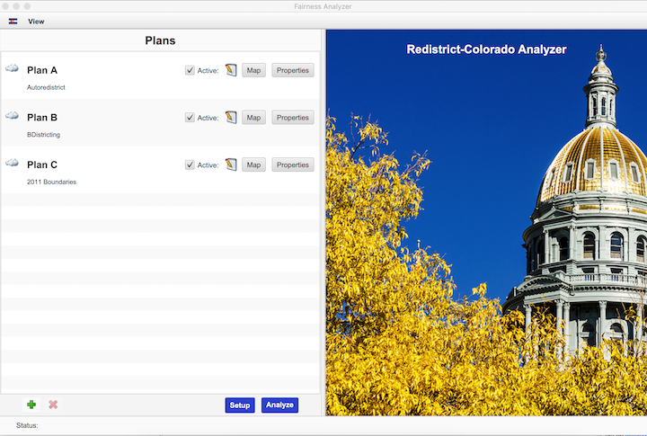
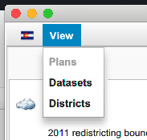
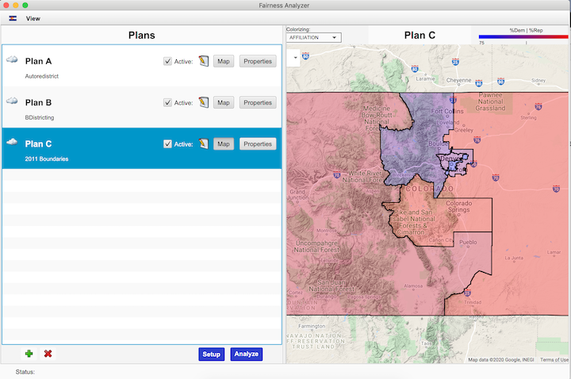
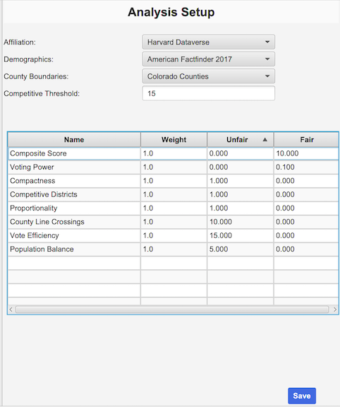
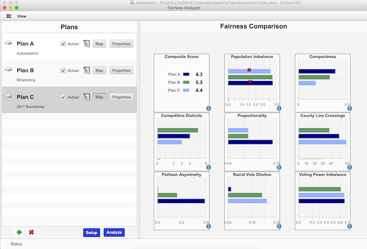
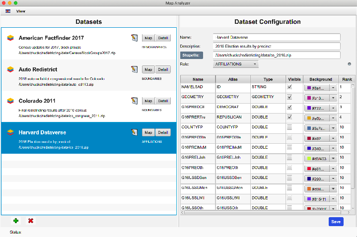
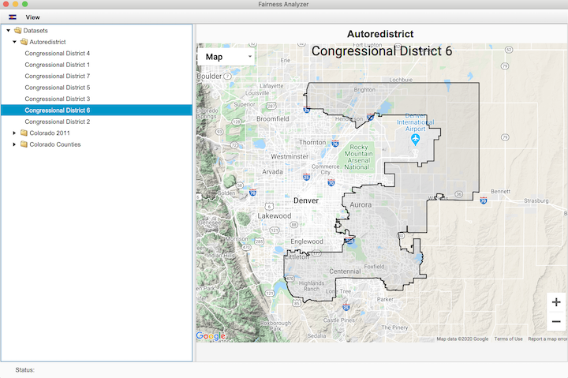

## Redistrict Colorado
## User Guide
*PlanAnalyzer* is designed to answer the question "Which is fairer?" when dealing with competing redistricting plans. The user configures plans and controls their evaluation based on a collection of external datasets which contain the plan geometries plus voter affiliation and demographic information. The application computes a set of 8 metrics for the purpose of evaluating two or more redistricting plans for fairness. See the [Comparisons](#Comparisons) page to view examples of final results.

This guide walks through the applications's user interface and defines the details of the metrics.

### Table of Contents <a id="table-of-contents"></a>

 * [Overview](#overview)
 * [Plans](#plans)
    * [Calculations](#calculations)
      * [Setup](#setup)
      * [Metrics](#metrics)
      * [Comparisons](#comparisons)
 * [Datasets](#datasets)
    * [Required Sets](#requirements)
    * [Finding Shapefiles](#sources)
    * [Attribute Aliases](#aliases)
 * [Districts](#districts)

### Overview <a id="overview"></a>


```                  Splash Screen     ```

The application's main interface is a split pane with
actions in the left side controlling what is displayed on the right. A *View* menu controls which of three contexts is displayed. The contexts are:
 * Plans - these are the redistricting plans. Each plan is based on a dataset containing voting district boundaries. Dialogs in this context include a setup panel for configuration of the weightings and selection of affiliation and demographic datasets necessary for plan evaluation. Most importantly in this context is an analysis panel which shows the result of side-by-side comparisons.
 * Datasets - a dataset holds information necessary for the construction and evaluation of a plan. Datasets are not part of the application as distributed, but are loaded in from files downloaded independently. Datasets correspond to a "shapefile" and contain geographic and other information.
 * Districts - a voting district is one of the regions of a dataset. The purpose of the *district* screen is to view boundary details of a dataset.


```                  View Menu     ```

### Plans <a id="plans"></a>
The figure below shows a plan superimposed over a Google Map. The Google Map has controls for pan, zoom and map type. In the figure map areas are colored to indicate the predominant affiliation within each district. The legend shows the numerical range associated with the color range. Other colorizing options include color coding by racial makeup of the district, or no colorization at all.


```                  Plan Overlay Onto Google Maps     ```

A 'click' within a
district will popup an information window with metrics for that district. Map views are accessible only if there is a current internet connection and the user has configured a valid Google key.

The next figure shows the plan dialog after selection of a "Properties" button. The screen shows aggregated quantities by district based on the boundary, affiliation and demographics datasets selected for the analysis. When this page is first selected, the application computes aggregated values. This is a compute-intensive process and may take as long as a minute or two. Once the calculations have been made, results are cached for speed in subsequent accesses.


```                  Plan Properties     ```

The next image shows the configuration screen for a plan. It is accessed by choosing the edit button for that plan from the plan list. Besides the name and description, the user must identify the dataset that is to be used to identify the district boundaries for that plan. The color selection refers to the bar color that will be used to identify this plan on the plan comparison page.


```                  Plan Definition     ```

#### Calculations <a id="calculations"></a>
The sections below describe calculations made for each of the comparison metrics. These are largely described in the application's comparison screen by selection of the appropriate blue "information" icon.

###### Setup <a id="setup"></a>
Before Comparisons can be made, the criteria for making that comparison must be configured. The datasets used to evaluate demographics and affiliations are set on the `Setup` screen shown below.


```                  Comparison Setup    ```

Additionally, parameters are defined for each of the separate metrics (with the exception of the `Composite`). These include a weighting and scaling range. The weighting defines the relative importance of the particular metric. The range defines the best and worst possible numeric values for the metric. This allows the values to be reasonably scaled with respect to each other. The "Info" button on the weightings table displays a screen for suggestions of reasonable limits for each metric.

##### Metrics <a id="metrics"></a>
###### Compactness:
To score compactness, we use the *Polsby-Popper Test*, essentially an *Isoperimetric Quotient* normalized to a circle. Specifically, this requires dividing the area of each district by the square of its perimeter and then dividing by 4𝛑, the isoperimetric quotient for a circle. This results in a value between 0.0 and 1.0. In order to obtain an overall plan score, we compute the harmonic mean of individual district scores. We want this value to be *maximized*.

###### Competitive Districts:
The number of "safe" or "non-competitive" districts should be minimized. In a non-competitive district, there is a chance that the minority party may not even field a serious candidate. This leaves voters with no real choices at election time. The score is simply the number of districts that are considered competitive.

On the setup page, the value "Competitiveness Threshold" specifies the maximum differential between party affiliations for a district to be considered competitive. 15% is often taken to be a reasonable value.

###### County Crossings:
This metric tracks the number of counties that are split across district boundaries. It is a crude measure of how well the plan preserves communities of interest. It is computed by tallying the number of counties contained or partially contained in a district and then subtracting the total number of counties. We want this score to be minimized. The same metric could be computed using municipal or other boundaries instead of counties if so desired. The limiting factor is the availability of *shapefiles* that define the boundaries.

###### Partisan Asymmetry:
Partisan asymmetry is a measure of the extent to which boundaries favor one party or the other. The application provides 5 different algorithms for this metric. These are listed below. Only one is used at a time in the composite calculation.

`Declination`
The declination function is described [here](https://observablehq.com/@sahilchinoy/gerrymandering-the-declination-function). It is a measure of partisan symmetry that does not assume any particular seats-votes proportionality. It is sensitive to either packing or cracking distortions. When plotted it results in a geometric angle that can be easily visualized. In our usage a negative angle indicates a Democratic advantage and a positive angle indicates a Republican advantage. An angle of more than 0.3 radians indicates probable manipulation.

  * Plot the Democratic district vote shares in increasing order
  * Plot point `R`, horizontally centered on the Republican districts, whose vertical position is the average Democratic vote share of all the Republican districts
  * Plot point `D`, which is the same as point `R` but for the Democratic districts
  * Plot point `M`, which is horizontally halfway at the transition between the Democratic and Republican districts, and vertically at 50% Democratic vote share
  * Draw line segments `RM` and `MD`, and compute the angle between them
  * Multiply the angle by a normalization factor of 2/π to get the declination. Its range is [-1,1].

Multiplying the declination by half the total number of seats in the state gives the approximate number of seats expected to be misallocated. Multiplying the declination by half the total number of seats in the state gives the approximate number of seats expected to be misallocated due to gerrymander.

`Efficiency Gap`
Efficiency gap is the sum of the differences between parties of "wasted" votes divided by the total number of projected votes. A "wasted" vote is any vote that does not help elect a candidate. This includes all the votes for the losing party and any votes over 50% for the winning party.

`Lopsided Wins`
Use the Student-t statistical metric to determine whether or not the distributions of vote-margin are similar between districts won by the two parties. This is a measure of the gerrymandering technique of "packing". This metric requires on the order of 30 or more districts to be significant. Thus it is not suitable for Colorado congressional districts.

`Mean-median`
Ask the question, "What percentage of the votes does it take to win 50% of the seats?". The difference between that and 50% is the Mean-median metric. It is a measure of vote-bias.

`Partisan-bias`
Partisan bias is a measure of seat bias. It is the difference between 50% and the percentage of seats obtained with 50% of the votes. The calculation of partisan bias is made directly from the vote-seats curve.

###### Population Balance:
The constitutionally-mandated purpose of redistricting is to balance the number of people within districts. A measure of population balance is simply the standard deviation of the population of the districts. We normalize by the total population, multiplied by 100, to give a result in percent. This value should be *minimized*.

Colorado sets the "unfair" limit of the difference between any district population and the mean at 5%. Some court cases have specified 1%. A red X indicator is drawn on the bar if any individual district has a deviation greater that the "unfair" limit specified by the user.

###### Proportionality:
Proportionality is the concept that the party mix of the elected officials should match the mix in the population as a whole. This metric compares the projected number of seats won by the dominant party versus the number of seats that were "deserved".  Any discrepancies greater than rounding error are flagged by putting the symbol of the benefiting party on the bar, meaning that the results are skewed in favor of that party.

The numerical value of the metric is the number of seats in excess of the "deserved" number for the dominant party. Ideally this is less than 1.

###### Racial Vote Dilution
This metric describes the extent, if any, to which voters of different ethnicities are disbursed across districts to avoid concentrations where they have a majority or near-majority. We define voting power as the ratio between the estimated votes by an ethnic group in a district and the vote margin. This value is scaled by the overall population to margin ratio. The final metric is the mean absolute deviation over the districts of the log of the result. A value of zero implies a perfectly homogeneous, i.e. diluted, distribution of voters. The metric value is the maximum score across the groups.

###### Voting Power Imbalance:
This metric is designed to ensure that the voting power of an ethnic group properly correlates to the fraction that they represent in the general population. The metric is calculated by taking fraction of population in a district represented by the group times the voting population divided by the vote margin. Normalize this by the overall population to vote margin. The harmonic mean across districts is taken, then the groups are compared. The final score is the difference between the highest and lowest scores.

###### Composite:
The composite or overall metric is a compendium of all the other measures with a weighting applied. The result is a number between 0 and 10. A score of 10 means that the plan is as fair as possible. Weighting and range limits from unfair-to-fair are taken from the setup screen.

The overall metric calculation assigns a value from 0-10 for each of the other metrics depending on how the score falls within the specified range. The composite result is simply the weighted average of the individual scores.  

##### Comparisons <a id="comparisons"></a>
The results page compares metrics for each plan. Evaluations are presented as bar charts with the bars ordered with the "best" result on top. Depending on the metric, a "good" result may be the smallest number. The composite score is a weighted average of scaled values of the 8 other values.


```                  Results    ```

Clicking on any of the comparison boxes will display a detail screen with additional statistics which support the results shown in the graphs. The makeup of these statistics is dependent on the metric.

### Datasets <a id="datasets"></a>

The following screen shows the Dataset context in a state just after pressing the "Edit" button for one of its entries.

```                  Dataset List     ```

On the right side, are components which allow us to change the properties of a dataset, its name, description, shapefile path and role. The role refers to the usage of the dataset in evaluation of a plan.
  * BOUNDARIES - defines the plan itself. It specifies
  the geometry of the district boundaries.
  * DEMOGRAPHICS - lists population counts both totals and by race within the overall plan boundaries. The boundaries of areas for which counts are tallied will almost certainly NOT coincide with the district boundaries.
  * AFFILIATION - as with the previous, datasets of this type are used to evaluate plans. Counts in this type of dataset reflect party affiliations.

In the figure above, the dataset had already been saved, at least once. Notice how the rows in its attribute list have been sorted by rank. This is also the order in which columns are ordered in the detail screen.

##### Required Sets <a id="requirements"></a>
In order to successfully define and compare plans the following datasets are required:
* boundaries - each redistricting plan must have an associated `shapefile` that defines its district boundaries.
* affiliations - plan comparisons require statewide historical or predicted voting results.
* demographics - plan comparisons also require population counts by ethnic group.

##### Finding Shapefiles <a id="sources"></a>
Web locations of representative and publicly available `shapefiles` that are compatible with the application
are listed [here](https://github.com/chuckcoughlin/redistrict-colorado/tree/master/docs/datasets.md).
Datasets of interest must be downloaded and stored locally. The application re-reads the files each time it accesses them for the first time in a new session.

##### Standard Attribute Aliases <a id="aliases"></a>
Within a shapefile, a feature corresponds to a geographical area and is represented by a polygon in latitude/longitude units. Features have an arbitrary set of attributes depending on the purpose of the file. There is no naming standard (that I am aware of) for these attributes. In order to correlate features from different dataset we have adopted a set of attributes aliases which are recognized by different elements of the application and which must be assigned by the user of
 *PlanAnalyzer*. These are:
  * ID - a unique identifier of the feature. This is the value that appears on the tree-view navigation panel in "District" scope.
  * BLACK - African-American population.
  * DEMOCRAT - votes cast for Democratic candidates.
  * DISTRICT - district identifier.
  * GEOMETRY - defines the feature's geographic layout.
  * HISPANIC - Hispanic population.
  * FEMALE - female population.
  * MALE - male population.
  * POPULATION - total population of the area.
  * REPUBLICAN - votes cast for Republican candidates.
  * WHITE - white population count.

 Note: Some of the demographic datasets do not include POPULATION as a feature attribute. For those datasets, the application computes the total population by adding FEMALE and MALE counts.

 Note: A DISTRICT column contains a name that
 indicates to which district the row belongs. Rows in the dataset correspond to individual voting districts. The final district (the one shown on the map) is the union of multiple voting districts each having the same name. The final number of districts is the number of unique names in the DISTRICT column. This data organization is used by the autoredistrict project. There may be others.  


### Districts <a id="districts"></a>
The *districts* section shows details of districts within any "boundary" dataset. The details are displayed simply by clicking on the district within the tree layout.
The figure below shows the resulting map superimposed over a Google Map. The Google Map has
controls for pan, zoom and map type. This allows for detailed inspection of the plan boundaries.

```                  District Overlay Onto Google Maps     ```
